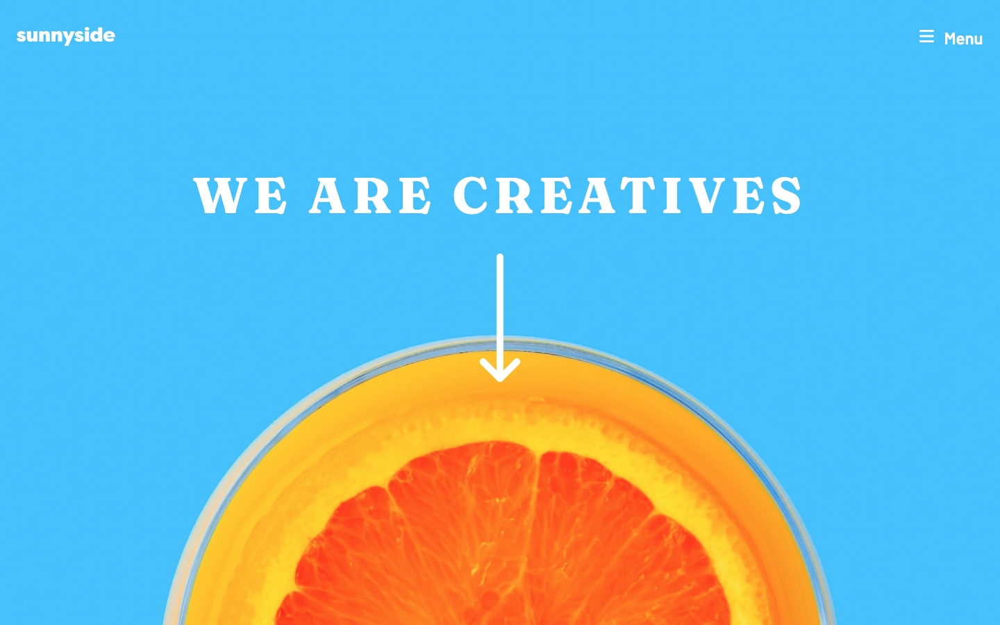

# Frontend Mentor - Sunnyside agency landing page solution

This is a solution to the [Sunnyside agency landing page challenge on Frontend Mentor](https://www.frontendmentor.io/challenges/sunnyside-agency-landing-page-7yVs3B6ef).

### The challenge

Users should be able to:

- View the optimal layout for the site depending on their device's screen size
- See hover states for all interactive elements on the page

### Screenshot

### Links

- Solution URL: [(https://github.com/claire-illustrates/sunnyside)]
- Live Site URL: [(https://claire-illustrates.github.io/sunnyside/)]

## My process

I used this challenge to work on my core skills, particularly layout and responsive sizing. I added some enhancements for accessibility, including adjusting colour contrast ratios, labelling sections using ARIA, and adding a skip link to enable users to skip past the navigation to the main if they so choose.  The navbar is hidden by default and toggled open and closed by interacting with the button, all functionality is correctly announced by a screen reader and fully accessible for keyboard only users including a 'focus trap' that keeps focus inside the menu when tabbing through. 

### Built with

- Semantic HTML5 markup
- CSS custom properties
- Flexbox
- Javascript
- ARIA
- Axe Dev Tools (Accessibility Testing)

Photo Credits:
Photo by <a href="https://unsplash.com/@nordwood?utm_source=unsplash&utm_medium=referral&utm_content=creditCopyText">NordWood Themes</a> on <a href="https://unsplash.com/photos/ivP3TYdLvw0?utm_source=unsplash&utm_medium=referral&utm_content=creditCopyText">Unsplash</a>
  
